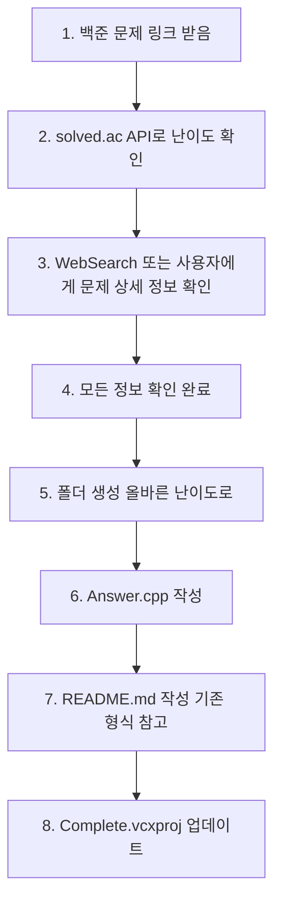

# 🎯 Claude Code 코딩테스트 프로젝트 설정

> **📅 마지막 업데이트**: 2025-10-07
> 
> **🎯 용도**: 코딩테스트 연습 및 알고리즘 문제 해결
> 
> **🌏 인코딩**: UTF-8 BOM 지원으로 한글 주석 완벽 지원

---

## 📑 목차 (Table of Contents)

1. [🔍 백준 문제 정보 파악 방법](#-백준-문제-정보-파악-방법)
2. [📋 프로젝트 정보](#-프로젝트-정보)
3. [🎨 코딩 스타일](#-코딩-스타일)
4. [🔄 작업 방식](#-작업-방식)
5. [🌏 한글 인코딩 설정](#-한글-인코딩-설정)
6. [🔧 Visual Studio 프로젝트 파일 관리](#-visual-studio-프로젝트-파일-관리)

---

<br>

# 🔍 백준 문제 정보 파악 방법

## ⚠️ 중요: 백준 문제 처리 시 필수 확인 사항

백준 문제를 처리할 때는 **반드시** 다음 프로세스를 따라야 합니다.

<br>

### 1️⃣ 문제 난이도 확인 (solved.ac API 활용)

```
✅ solved.ac API로 난이도 먼저 확인
https://solved.ac/api/v3/problem/show?problemId={문제번호}
```

**📊 확인 정보**
- 문제 번호
- 문제 제목
- 난이도 (tier/level): Bronze 1~5, Silver 1~5, Gold 1~5 등

**💡 예시**
```
문제 링크: https://www.acmicpc.net/problem/10988
→ solved.ac API: https://solved.ac/api/v3/problem/show?problemId=10988
→ 결과: Level 3 (Bronze 3)
```

<br>

### 2️⃣ 문제 상세 정보 파악

> **🚫 백준 사이트 직접 접근 불가**
> 백준(acmicpc.net) 사이트는 403 Forbidden 에러로 직접 접근이 차단됩니다.

**✅ 대안 방법**

| 방법 | 설명 |
|-----|------|
| **WebSearch** | 백준 문제 번호와 제목으로 검색하여 다른 블로그/사이트에서 문제 내용 확인 |
| **사용자 확인** | "백준 사이트에 직접 접근할 수 없어서, 다음 정보를 확인해주시겠어요?" 요청 |

**📋 반드시 파악해야 할 정보**

| 항목 | 설명 | 필수 여부 |
|-----|------|----------|
| 문제 내용 | 문제가 요구하는 것이 무엇인지 | ✅ 필수 |
| 입력 형식 | 어떤 형식으로 입력이 주어지는지 | ✅ 필수 |
| 출력 형식 | 어떤 형식으로 출력해야 하는지 | ✅ 필수 |
| 예제 입력 | 테스트 케이스 입력 | ✅ 필수 |
| 예제 출력 | 테스트 케이스 출력 | ✅ 필수 |
| 출처 | 문제의 출처 | ⚪ 선택 |
| 알고리즘 분류 | 어떤 알고리즘을 사용하는지 | ⚪ 선택 |

<br>

### 3️⃣ 정보 확인 없이 작업 금지

<table>
<tr>
<td width="50%">

**❌ 절대 하지 말 것**
- 난이도를 추측해서 폴더 생성
- 문제 내용을 확인하지 않고 README 작성
- 불확실한 정보로 파일 생성

</td>
<td width="50%">

**✅ 올바른 접근**
1. solved.ac API로 난이도 확인
2. WebSearch 또는 사용자에게 문제 상세 정보 확인
3. 모든 정보가 확인된 후 작업 시작
4. README.md에 정확한 정보 기록

</td>
</tr>
</table>

<br>

### 🎯 작업 순서 플로우차트



---

<br>

# 📋 프로젝트 정보

## 🎮 프로젝트 용도

| 항목 | 내용 |
|-----|------|
| **주목적** | 코딩테스트 연습 및 알고리즘 문제 해결 |
| **개발환경** | Visual Studio C++ 콘솔 애플리케이션 |
| **플랫폼** | Windows 기반 |

<br>

## 📚 참고 자료

프로젝트 내 PDF 파일들을 우선적으로 참고하여 코딩:

| 파일명 | 용도 |
|-------|------|
| **C++문법 교안.pdf** | C++ 문법 및 구문 참고 |
| **개념 교안.pdf** | 알고리즘 개념 및 이론 참고 |
| **문제 정답.pdf** | 문제 해답 및 풀이 참고 |

---

<br>

# 🎨 코딩 스타일

> ✅ **Complete 프로젝트는 공부를 완료한 코드들**
> 내 스타일에 맞게 수정된 코드들이기 때문에, 코드 스타일을 참고한다.

<br>

## 📦 헤더 및 네임스페이스

```cpp
#include <bits/stdc++.h>
using namespace std;
```

| 항목 | 설명 |
|-----|------|
| **모든 라이브러리** | `bits/stdc++.h`로 통합 (코테 최적화) |
| **네임스페이스** | `using namespace std` 사용 |
| **성능보다 속도** | 빠른 코딩을 위한 선택 |

<br>

## 🌐 전역 변수 선언

```cpp
// 전역 변수들은 상단에 선언하고 정렬
int    visited[54][54], a[54][54], n, l, r;
int    sum = 0, cnt = 0;
bool   flag = false;
vector<pair<int,int>> uni;
```

**정렬 규칙**

| 규칙 | 설명 |
|-----|------|
| **타입 정렬** | 동일한 타입끼리 그룹화 |
| **컬럼 정렬** | 타입 / 변수명 / = / 초기값 정렬 |
| **의미별 그룹** | 관련 변수들끼리 묶어서 선언 |
| **bool 권장** | 사용 여부 체크는 `int`보다 `bool` 타입 권장 (메모리 효율, 의미 명확) |

<br>

## 🔧 함수 및 메서드 스타일

```cpp
// 함수명과 중괄호 스타일
void dfs(int y, int x)
{
    for(int i = 0; i < 4; i++)
    {
        // 로직 구현
    }
}
```

**중괄호 규칙**

| 규칙 | 설명 |
|-----|------|
| **다음 줄 배치** | 함수와 제어문의 중괄호는 다음 줄에 |
| **들여쓰기** | 4칸 스페이스 사용 |
| **일관성** | 모든 블록에서 동일한 스타일 적용 |

<br>

## 💬 주석 스타일

### 📝 변수 설명 주석

```cpp
// 전역 변수 설명 주석 (한 줄)
int         N, K;              // N = 내위치, K = 동생 위치
int         visited[MAX + 4];  // 각 위치까지의 최소 시간
int         parent[MAX + 4];   // 각 위치로 오기 전의 이전 위치
vector<int> v;                 // 경로 저장용

// 라인별 주석 정렬
visited[ny][nx] = 1;     // 방문 처리
uni.push_back({ny, nx}); // 연합에 추가
sum += a[ny][nx];        // 연합의 총 인구수에 추가
dfs(ny, nx);             // 재귀적으로 DFS 계속 진행
```

<br>

### 🔍 함수 매개변수 주석

**매개변수 설명 시 콜론(`:`) 앞뒤로 공백 한 칸씩 배치**

```cpp
// 두 숫자가 주어진 부등호 조건을 만족하는지 확인하는 함수
// x : 왼쪽 숫자(문자), y : 오른쪽 숫자(문자), op : 부등호 기호
bool Check(char x, char y, char op)
{
    // ...
}

// 백트래킹으로 모든 경우의 수를 탐색하는 재귀 함수
// idx : 현재 채울 위치 (0부터 n까지, 총 n+1개 숫자)
// num : 현재까지 만든 숫자 문자열
void go(int idx, string num)
{
    // ...
}
```

<br>

**주석 규칙**

| 규칙 | 설명 |
|-----|------|
| **변수 설명** | 전역 변수 선언 후 각각의 역할 설명 |
| **함수 설명** | 매개변수와 동작 방식 설명 |
| **콜론 공백** | **매개변수 설명 시 `: 앞뒤로 공백` (예: `x : 설명`)** |
| **라인 정렬** | 같은 블록 내 주석들의 시작 위치 통일 |
| **명확성** | 알고리즘 로직을 이해하기 쉽게 설명 |

<br>

## ⚡ main 함수 구조

```cpp
int main()
{
    ios_base::sync_with_stdio(false);cin.tie(0);cout.tie(0);

    // 입력 처리
    cin >> n >> l >> r;

    // 알고리즘 로직
    // ...

    // 결과 출력
    cout << cnt << "\n";
    return 0;
}
```

**필수 포함 사항**

| 항목          | 설명                                                         |
|-------------|------------------------------------------------------------|
| **입출력 최적화** | `ios_base::sync_with_stdio(false);cin.tie(0);cout.tie(0);` |
| **간결한 구조**  | 입력 → 처리 → 출력 순서                                            |
| **명확한 구분**  | 각 단계별로 주석으로 구분                                             |
| **필요시 메서드** | 메인 로직이 너무 길어지면, 핵심 알고리즘을 메서드로 묶기                           |

---

<br>

# 🔄 작업 방식

## 📦 Complete 폴더로 정리 작업 프로세스

### ⚠️ 중요: "정리" 키워드 인식

사용자가 다음과 같이 말하면 **자동으로 Complete 정리 작업 시작**:

```
✅ "Complete에 작업한 내용을 옮겨서 정리"
✅ "Complete로 정리"
✅ "완료한 문제 정리해줘"
✅ "문제 풀이 Complete로 옮겨줘"
```

<br>

### 🎯 Complete 정리 작업 9단계 절차

| 단계 | 작업 내용                                                                                                                              |
|-----|------------------------------------------------------------------------------------------------------------------------------------|
| **1️⃣ Test.cpp 확인** | 현재 Test.cpp에 작성된 코드 읽기<br>어떤 문제인지 파악 (주석, 변수명 등 참고)                                                                                |
| **2️⃣ 문제 정보 확인** | 백준 문제라면: solved.ac API로 난이도 확인<br>WebSearch로 문제 상세 정보 검색<br>또는 사용자에게 문제 링크/번호 확인                                                   |
| **3️⃣ 기존 형식 참고** | 최소 3개 이상의 기존 README.md 파일 읽기<br>폴더명 규칙 확인 (예: B2_10808_알파벳개수)<br>README.md 작성 형식 확인 (작성일, 문제 링크, 접근법 등)<br>코드 스타일 확인 (주석, 정렬 규칙 등) |
| **4️⃣ 폴더/파일 생성** | `Complete/백준/{티어}_{문제번호}_{문제명}/`<br>├── `Answer.cpp.txt` ← Test.cpp 코드 복사 (스타일 정리)<br>└── `README.md` ← 기존 형식과 동일하게 작성                 |
| **5️⃣ Answer.cpp.txt** | Test.cpp의 코드를 복사하여 `.cpp.txt` 확장자로 저장<br>UTF-8 BOM 포함<br>코딩 스타일 가이드에 맞게 정리<br>**⚠️ 주의: Complete 폴더는 `.cpp.txt` 확장자 사용** (컴파일 대상 제외)                                                                              |
| **6️⃣ README.md** | **반드시 기존 README 파일들의 형식을 참고**<br>📅 작성일 / 🔗 문제 링크 / 🤔 접근법 / 💡 풀이 방법 / ⏱️ 시간복잡도 포함                                               |
| **7️⃣ vcxproj 업데이트** | `<None>` 섹션에 Answer.cpp.txt 추가<br>`<None>` 섹션에 README.md 추가<br>**⚠️ 중요: .cpp.txt는 `<None>` 태그 사용** (컴파일 제외)<br>알파벳순으로 정렬 유지                                                       |
| **8️⃣ 파일명 확인** | Answer.cpp.txt 파일명이 올바른지 확인<br>`.cpp` 확장자가 아닌 `.cpp.txt` 확장자인지 검증 |
| **9️⃣ 검증** | 모든 파일이 올바른 위치에 생성되었는지 확인<br>README.md 형식이 기존 파일들과 동일한지 확인<br>.vcxproj 파일이 올바르게 업데이트되었는지 확인                                         |

<br>

### 📋 README.md 작성 시 필수 참고 사항

<table>
<tr>
<td width="50%" bgcolor="#ffe6e6">

**❌ 절대 하지 말 것**
- 임의로 형식을 변경하거나 새로운 스타일로 작성
- 기존 README들을 확인하지 않고 작성
- 간단한 내용으로 대충 작성

</td>
<td width="50%" bgcolor="#e6ffe6">

**✅ 반드시 해야 할 것**
1. 최소 3개 이상의 기존 README.md 파일 읽기
2. 동일한 섹션 구조 사용
3. 동일한 이모지 사용
4. 동일한 설명 스타일 사용
5. 작성일을 현재 날짜로 기록

</td>
</tr>
</table>

<br>

### 💡 자동화 예시

**사용자 입력:**
```
"Complete에 작업한 내용을 옮겨서 정리"
```

**Claude의 자동 작업 순서:**
```
✅ 1. Test.cpp 읽기
✅ 2. solved.ac API로 난이도 확인
✅ 3. 기존 README 2개 읽어서 형식 파악
✅ 4. 폴더 생성 (올바른 티어로)
✅ 5. Answer.cpp.txt 작성 (Test.cpp 복사 + 스타일 정리)
✅ 6. README.md 작성 (기존 형식과 동일하게)
✅ 7. Complete.vcxproj 업데이트 (.cpp.txt는 <None> 태그로)
✅ 8. 파일명 .cpp.txt 확인
✅ 9. 완료 메시지 출력
```

> **⚠️ 주의사항**
> - 정리 작업은 **자동으로 진행**하되, 정보가 부족하면 사용자에게 확인
> - README 형식은 **절대 임의로 변경하지 않음**
> - 모든 단계를 TodoWrite로 추적하여 진행 상황 표시

<br>

---

## 📚 참고 자료 우선순위

```
1. PDF 교안 → 프로젝트 내 PDF 파일들 우선 참고
2. 기존 코드 → Complete 폴더의 스타일 패턴 따르기
3. 기존 README → README.md 작성 시 반드시 참고
4. 알고리즘 효율성 → 정확성 > 성능 최적화
```

<br>

## 🎯 코딩 테스트 최적화

| 항목 | 설명 |
|-----|------|
| **빠른 구현** | 복잡한 구조보다는 직관적인 코드 |
| **전역 변수 활용** | 함수 간 데이터 전달 간소화 |
| **STL 적극 활용** | vector, pair, queue 등 자유롭게 사용 |
| **입출력 최적화** | 모든 문제에서 기본적으로 적용 |

<br>

## 🚫 피해야 할 것들

- ❌ **과도한 객체지향** : 클래스보다는 함수 중심
- ❌ **복잡한 템플릿** : 간단하고 명확한 코드 우선
- ❌ **불필요한 최적화** : 동작하는 코드를 먼저 완성

<br>

## ✅ 코드 검토 체크리스트

- [ ] 전역 변수 정렬이 올바른가?
- [ ] 주석이 정렬되어 있는가?
- [ ] 중괄호 스타일이 일관된가?
- [ ] ios_base 최적화가 포함되었는가?
- [ ] PDF 교안의 패턴을 따르고 있는가?

---

<br>

# 🌏 한글 인코딩 설정

## 🔧 UTF-8 BOM 설정 (한글 주석 지원)

> **⚠️ 중요**: Windows 환경에서 한글 주석이 깨지지 않게 하려면 반드시 UTF-8 BOM을 사용해야 합니다.

<br>

### 📋 Claude Code에서 파일 생성 시 설정

```bash
# UTF-8 BOM을 포함한 파일 생성 방법
echo -e "\xEF\xBB\xBF#include <bits/stdc++.h>" > filename.cpp
```

**🔍 BOM 바이트 구조**
- `\xEF\xBB\xBF` = UTF-8 BOM (Byte Order Mark)
- 파일 맨 앞 3바이트로 UTF-8 인코딩임을 시스템에 알림

<br>

### 🛠️ Visual Studio 수동 설정 방법

| 방법 | 절차 |
|-----|------|
| **방법 1:<br>파일별 인코딩** | 1. Visual Studio에서 .cpp 파일 열기<br>2. `파일` → `고급 저장 옵션`<br>3. 인코딩을 `유니코드(UTF-8 서명 있음) - 코드 페이지 65001`로 변경<br>4. 저장 후 한글 주석이 제대로 표시되는지 확인 |
| **방법 2:<br>프로젝트 전체** | 1. 프로젝트 속성 → `구성 속성` → `C/C++` → `명령줄`<br>2. 추가 옵션에 `/utf-8` 추가<br>3. 모든 .cpp 파일에 적용됨 |
| **방법 3:<br>메모장 활용** | 1. 메모장에서 코드 작성<br>2. 저장 시 인코딩을 `UTF-8`로 선택<br>3. Visual Studio에서 해당 파일 열기 |

<br>

### 📝 문제 해결 가이드

<table>
<tr>
<td width="50%">

**🚨 한글이 깨질 때**
1. 파일이 UTF-8 BOM으로 저장되었는지 확인
2. Visual Studio 인코딩 설정 확인
3. 필요시 파일을 새로 생성하여 UTF-8 BOM 포함

</td>
<td width="50%">

**💡 예방 방법**
- 새 파일 생성 시 항상 UTF-8 BOM 포함
- 프로젝트 설정에서 `/utf-8` 옵션 추가
- 코드 작성 전 인코딩 설정 확인

</td>
</tr>
</table>

---

<br>

# 🔧 Visual Studio 프로젝트 파일 관리

## ⚠️ 중요: 파일 생성 후 프로젝트 등록 필수!

> **문제 상황**
> Claude Code로 파일(.cpp, .md 등)을 생성하면, 파일 시스템에는 생성되지만 Visual Studio/JetBrains Rider 솔루션 탐색기에 표시되지 않습니다.

> **원인**
> Visual Studio C++ 프로젝트는 `.vcxproj` 파일에 모든 소스 파일 목록을 명시적으로 관리합니다. 파일 시스템에 파일이 있어도 프로젝트 파일에 등록되지 않으면 IDE에서 보이지 않습니다.

<br>

## 📋 파일 생성 후 필수 작업 절차

### 1️⃣ 새 폴더/파일 생성 시

```
Complete/백준/Bronze/B2_10808_알파벳개수/
├── Answer.cpp
└── README.md
```

<br>

### 2️⃣ Complete.vcxproj 파일 수정

**프로젝트 파일 위치:**
```
C:\Users\ASUS\Desktop\Code\CoTe\Coding-Test-Practice\Complete\Complete.vcxproj
```

**📌 .cpp.txt 파일 추가** - `<ItemGroup>` 내 `<None>` 섹션에 추가
```xml
<ItemGroup>
  <None Include="백준\Bronze\B1_2309_일곱난쟁이\Answer(Combination).cpp.txt" />
  <None Include="백준\Bronze\B2_10808_알파벳개수\Answer.cpp.txt" />  <!-- 새로 추가 -->
  <None Include="백준\Gold\G4_12851_숨바꼭질2\Answer.cpp.txt" />
</ItemGroup>
```

**⚠️ 중요: Complete 폴더는 `.cpp.txt` 확장자 사용**
- Complete 폴더의 C++ 파일은 컴파일 대상이 아니므로 `<None>` 태그 사용
- Test.cpp와의 변수명 충돌 방지를 위해 `.cpp.txt` 확장자로 저장

**📌 README.md 파일 추가** - `<ItemGroup>` 내 `<None>` 섹션에 추가
```xml
<ItemGroup>
  <None Include="백준\Bronze\B1_2309_일곱난쟁이\README.md" />
  <None Include="백준\Bronze\B2_10808_알파벳개수\README.md" />  <!-- 새로 추가 -->
</ItemGroup>
```

<br>

### 3️⃣ 파일 타입별 태그 규칙

| 파일 확장자 | XML 태그 | 용도 |
|-----------|---------|------|
| `.cpp.txt` | `<None>` | **C++ 소스 파일 (컴파일 제외)** - Complete 폴더 전용 |
| `.cpp` | `<ClCompile>` | C++ 소스 파일 (컴파일 대상) - Test 폴더 전용 |
| `.h`, `.hpp` | `<ClInclude>` | C++ 헤더 파일 |
| `.md` | `<None>` | 문서 파일 (비컴파일) |
| `.png`, `.jpg` | `<Content>` | 리소스 파일 |
| `.txt` | `<None>` | 텍스트 파일 |

**⚠️ 중요: Complete 폴더 전용 규칙**
- Complete 폴더의 모든 C++ 파일은 `.cpp.txt` 확장자 사용
- 이유: Test.cpp와의 변수명 충돌 방지 및 컴파일 대상에서 제외
- Test 폴더는 일반 `.cpp` 확장자 사용 (실제 실행 및 테스트용)

<br>

### 4️⃣ 정렬 규칙

| 규칙 | 설명 |
|-----|------|
| **알파벳 순서** | 백준 → 해커랭크, Bronze → Gold |
| **티어별 정렬** | B1 → B2 → B3, G1 → G2 → G3 |
| **문제 번호** | 낮은 번호부터 |

<br>

## 🤖 Claude Code 작업 시 자동화 가이드

**파일 생성 작업 플로우:**

| 단계 | 작업 |
|-----|------|
| **1. 폴더 생성** | `powershell "New-Item -ItemType Directory -Path 'Complete\백준\Bronze\B2_문제명' -Force"` |
| **2. 파일 작성** | Write tool 사용 (UTF-8 BOM 포함)<br>- **Answer.cpp.txt** (`.cpp.txt` 확장자!)<br>- README.md |
| **3. vcxproj 업데이트** | Edit tool로 Complete.vcxproj 수정<br>- `<None>` 섹션에 .cpp.txt 추가 (컴파일 제외!)<br>- `<None>` 섹션에 .md 추가<br>- 알파벳순으로 정렬 유지 |
| **4. 검증** | Rider/Visual Studio에서 솔루션 탐색기 확인<br>새로 추가한 파일들이 표시되는지 확인<br>**파일명이 .cpp.txt인지 재확인** |

<br>

## 🚨 주의사항

<table>
<tr>
<td width="50%" bgcolor="#ffe6e6">

**❌ 하지 말아야 할 것**
- 프로젝트 파일 업데이트 없이 파일만 생성
- XML 문법 오류 (닫는 태그 누락, 특수문자 이스케이프 등)
- 중복 항목 추가

</td>
<td width="50%" bgcolor="#e6ffe6">

**✅ 반드시 해야 할 것**
- 파일 생성 직후 즉시 .vcxproj 업데이트
- 상대 경로 사용 (백준\Bronze\...)
- 백슬래시(\) 사용 (Windows 경로 규칙)
- 알파벳순 정렬 유지

</td>
</tr>
</table>

<br>

## 💡 빠른 참조

**Complete.vcxproj 파일 구조:**
```xml
<Project>
  ...
  <ItemGroup>
    <None Include="백준\Bronze\B2_10808_알파벳개수\Answer.cpp.txt" />  <!-- .cpp.txt 파일들 (컴파일 제외) -->
    <None Include="백준\Bronze\B2_10808_알파벳개수\README.md" />      <!-- .md 파일들 -->
  </ItemGroup>
  <ItemGroup>
    <Content Include="..." />    <!-- 이미지 등 -->
  </ItemGroup>
  ...
</Project>
```

**⚠️ 중요: Complete 프로젝트는 .cpp.txt 사용**
- 모든 C++ 소스 파일은 `.cpp.txt` 확장자
- `<None>` 태그로 컴파일 대상에서 제외
- Test.cpp와의 변수명 충돌 완전 방지

---

<br>

## 📌 문서 정보

| 항목 | 내용 |
|-----|------|
| **📅 마지막 업데이트** | 2025-10-07 |
| **🎯 용도** | 코딩테스트 연습 및 알고리즘 문제 해결 |
| **🌏 인코딩** | UTF-8 BOM 지원으로 한글 주석 완벽 지원 |
| **🔧 프로젝트 관리** | .vcxproj 파일 자동 업데이트 필수 |

---

**[↑ 목차로 돌아가기](#-목차-table-of-contents)**
