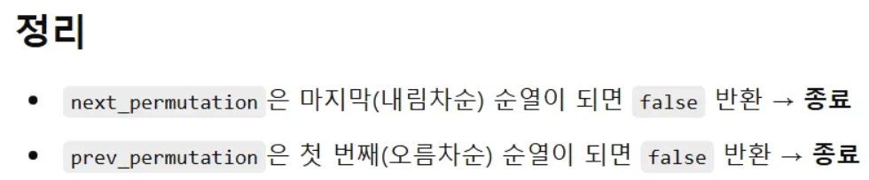
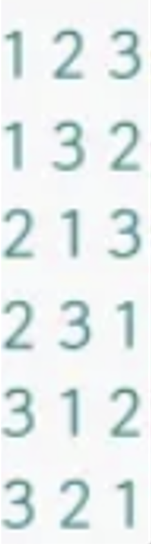

**📅 작성일**: 2025-01-01

## 🔗 문제 링크
[백준 2309번 - 일곱 난쟁이](https://www.acmicpc.net/problem/2309)

---

## 🤔 접근법
9명 중에서 7명을 선택하는 문제는 결국 2명을 제외하는 문제와 같다.

여러 가지 방법으로 해결 가능하다: 브루트 포스, 순열, STL 활용 등

순열로 해결 하였다.

---

## 💡 풀이 방법

1. **[Answer(Recursive).cpp](./Answer(Recursive).cpp)** - 순열 방식

   
        정렬 후, next_permutation을 사용하여 모든 순열을 생성.

        앞 7명의 합이 100인 경우를 찾아 출력.

2. **[Answer(Combination).cpp](./Answer(Combination).cpp)** - 조합 브루트 포스 방식

        이중 반복문으로 제외할 2명을 찾는 방식.

        전체 합에서 2명의 키를 뺀 값이 100인지 확인.

        가장 직관적이고 효율적인 방법. O(9²) = O(81)

3. **[Answer(Permutation).cpp](./Answer(Permutation).cpp)** - 재귀 순열 방식

        재귀 함수로 순열을 직접 구현하여 9명 중 7명을 선택.

        순열의 앞 7명의 합이 100인지 확인하는 방식.